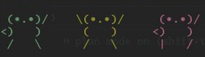

# `Codex-Together`

    
    
<i>You can just build stuff, together.</i>

`Codex Together` is an invite-based collaborative workspace where users can host a local Together server, share and replay threads, and enforce fork-first collaboration instead of directly editing another person's thread.

## Codex Together Architecture

The control flow is:

1. A user triggers a Together action from the TUI, usually via a slash command.
2. `codex-rs/tui/src/chatwidget.rs` parses the command and dispatches a Together operation.
3. The TUI connects to a local or remote Together WebSocket endpoint using `codex-together-protocol`.
4. If the endpoint is local, the TUI can auto-start `codex together-server`.
5. `codex-together-server` uses the existing Codex app-server bridge to read or fork local threads when necessary.
6. Shared thread metadata, members, forks, and current Together session state are written into the SQLite state database in `codex-rs/state/`.

## Key Behavior of the Together Layer

| Capability | Behavior |
| --- | --- |
| Hosting | Creates a locally hosted Together server and exposes a shareable invite/public URL. |
| Joining | Members join using an ngrok URL, invite token, `codex://together/...` link, or known short server id. |
| Sharing | A thread can be shared with persisted rollout history so other users can inspect and replay it. |
| Checkout | A shared thread can be checked out into the local UI. Owners get writable checkout; non-owners get read-only checkout. |
| Forking | Non-owners are expected to fork a shared thread before doing their own work. |
| Lineage | Parent/child thread relationships are tracked and rendered as a lineage/history tree. |
| Replay | Checked-out or forked threads can be replayed into the TUI transcript as if resumed locally. |
| Presence | The Together Center polls server presence and shows connected members, plus optional mascot/motion UI. |
| Persistence | Together server state and last-known client session survive restart via SQLite state. |

## User-Facing Together Commands

These are the main TUI commands exposed to users.

### Top-Level Slash Commands

| Command | Meaning |
| --- | --- |
| `/host` | Start or reconnect to a local Codex Together server. |
| `/join <ngrok-url-or-invite-id>` | Join a Together server using a public URL, invite token, `codex://together/...` link, or short id. |
| `/leave` | Leave the current Together server as a member. |
| `/close` | Close the current hosted Together server as the owner/host. |
| `/share [thread-id]` | Share the current thread, or an explicit thread id, to the Together server. |
| `/threads` | Open the searchable shared-threads picker. |
| `/history` | Open the lineage/history picker for the checked-out or current Together thread. |
| `/together` | Open Together Center or dispatch a Together subcommand. |

### Together-Aware Existing Commands

| Command | Together-specific effect |
| --- | --- |
| `/status` | If connected, also queries and shows Together server status. |
| `/exit` | If connected, leaves or closes the Together session before quitting Codex. |

### `/threads` View Actions

| Action | Meaning |
| --- | --- |
| `Enter` | Checkout the selected shared thread. |
| `f` | Fork the selected shared thread. |
| `d` | Delete the selected shared thread if you are its owner. |

### `/history` View Actions

| Action | Meaning |
| --- | --- |
| `Enter` | Checkout the selected thread in the lineage tree. |
| `f` | Fork the selected thread. |
| `d` | Delete the selected thread if you are its owner. |

## `/together` Subcommands

Under the hood, `/together` is a command router implemented in `codex-rs/tui/src/chatwidget.rs`.

| Subcommand | Meaning |
| --- | --- |
| `/together help` | Show Together command help. |
| `/together create` | Same core action as `/host`. |
| `/together join <target>` | Same core action as `/join`. |
| `/together leave` | Same core action as `/leave`. |
| `/together close` | Same core action as `/close`. |
| `/together share [thread-id]` | Same core action as `/share`. |
| `/together checkout <thread-id>` | Checkout a shared thread directly by id. |
| `/together fork <thread-id>` | Fork a shared thread directly by id. |
| `/together delete <thread-id>` | Delete a shared thread directly by id, owner only. |
| `/together list [search-term]` | List shared threads, optionally filtered by search text. |
| `/together history <root-thread-id>` | Show lineage text output for an explicit root thread. |
| `/together lineage <root-thread-id>` | Alias of `history`. |
| `/together status [endpoint]` | Inspect Together server status, optionally against an explicit endpoint. |
| `/together mascot` | Show mascot display settings. |
| `/together mascot on` | Enable mascot rendering in Together Center. |
| `/together mascot off` | Disable mascot rendering. |
| `/together mascot motion on` | Enable mascot motion/animation. |
| `/together mascot motion off` | Disable mascot motion/animation. |
| `/together mascot labels masked` | Mask email labels in Together Center. |
| `/together mascot labels full` | Show full email labels in Together Center. |

## Internal/Protocol-Level Together Commands

These are the JSON-RPC methods defined in `codex-rs/together-protocol/src/lib.rs`. They are useful if you are trying to understand the programmatic contract rather than only the TUI surface.

| Method | Purpose |
| --- | --- |
| `initialize` | JSON-RPC-style protocol initialization. |
| `initialized` | Notification indicating initialization completed. |
| `together/auth` | Set or confirm the caller identity/email for the connection. |
| `together/server/create` | Create a Together server session. |
| `together/server/close` | Close a hosted Together server. |
| `together/member/add` | Add a member to the current server. |
| `together/member/remove` | Remove a member from the current server. |
| `together/server/info` | Read current server metadata and connected members. |
| `together/thread/share` | Share a thread into the Together server. |
| `together/thread/checkout` | Inspect whether a thread is writable or read-only for the caller. |
| `together/thread/read` | Read replayable messages and optional persisted history for a shared thread. |
| `together/thread/fork` | Fork a shared thread into a new child thread. |
| `together/thread/delete` | Delete a shared thread. |
| `together/thread/list` | List shared threads. |
| `together/history/lineage` | Return nodes and edges for thread lineage. |
| `together/join` | Join a Together server. |
| `together/leave` | Leave a Together server. |

### Related Notifications

| Notification | Purpose |
| --- | --- |
| `together/serverClosed` | Broadcast that the host closed the Together server. |
| `together/memberUpdated` | Broadcast member join/remove changes. |
| `together/threadShared` | Broadcast that a thread was shared. |
| `together/threadForked` | Broadcast that a thread was forked. |
| `together/connectionRevoked` | Notify a specific member that access was revoked. |